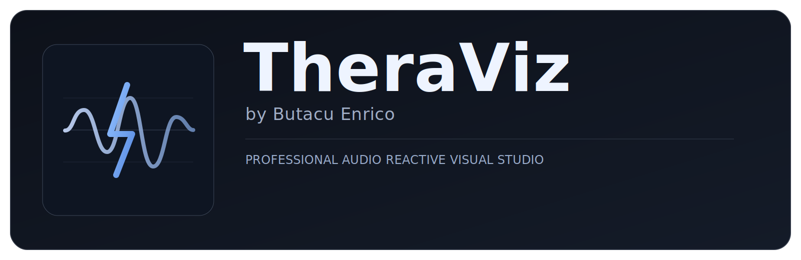

# TheraViz



TheraViz is a professional audio-reactive visual generator for artists.

## GitHub About

TheraViz by Butacu Enrico is a professional audio-reactive visual studio to create, edit, and export HD music videos synchronized to your track.

## Signature

UI title includes: **TheraViz** with small subtitle **by Butacu Enrico**.

## Features

- Upload audio tracks and generate audio-reactive visuals
- Multiple visual systems:
  - Sculpt 3D
  - Waveform Ribbon
  - Lightning Lattice
  - Spectrum Columns
  - Hybrid Director
- Rich shape library (icosahedron, torus, helix, plane, capsule, and more)
- Real-time editing (color, motion, FX, sensitivity)
- Presets saved in browser localStorage
- Project import/export as JSON
- Video export with audio sync (WebM or MP4 when browser supports it)
- High-definition export settings (up to 4K)

## Run locally

```bash
cd BNGRSVizualizer
python3 -m http.server 4173
```

Open: `http://localhost:4173`

## Live site

`https://butacuenrico.github.io/TheraViz/`

## Usage

1. Click `LOAD AUDIO` and choose a track.
2. Configure visuals in Audio / Shape / FX / Color tabs.
3. Go to `Export`, choose FPS + resolution + bitrate.
4. Click `Export Video` and wait until track end.

## Browser recommendations

- Best: Chrome or Edge (better MediaRecorder support)
- Safari/Firefox may not support all export codecs

## Deploy

This is a static web app. You can deploy on:

- Vercel
- Netlify
- GitHub Pages

No backend required.

## License

MIT License. See `LICENSE`.
